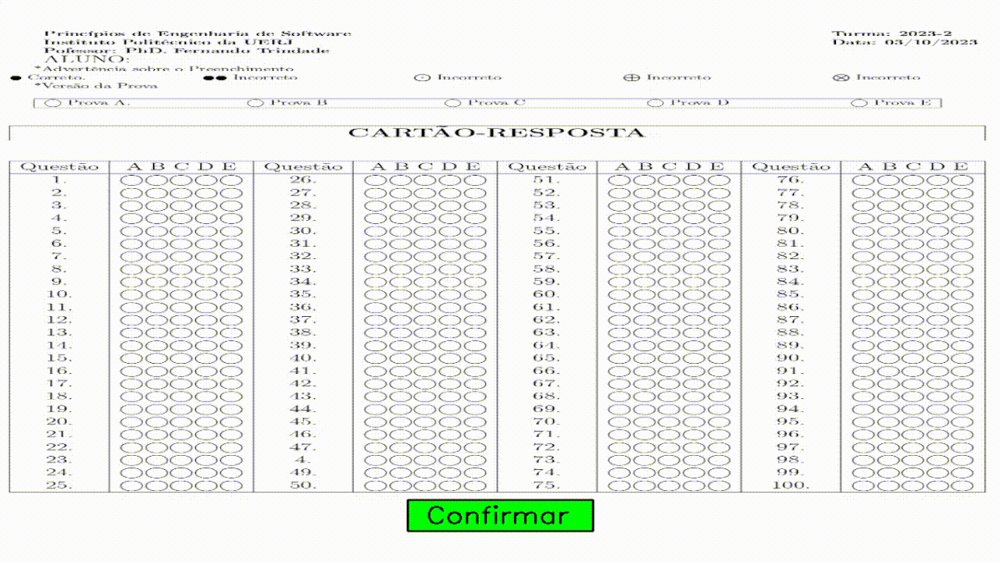
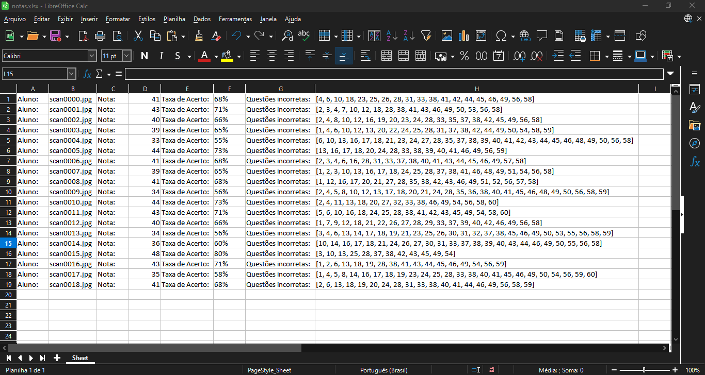

# Corretor de Provas

O seguinte programa em python foi desenvolvido pensando em automatizar o processo de correção de **provas de múltipla-escolha**. Por óbvio, ele somente funciona para provas em um determinado padrão: disponível dentro da pasta 'Leitor'. É Também possível que o usuário escolha criar um próprio gabarito, que será priorizado na correção das provas.

As principais bibliotecas/módulos utilizados foram: **OpenCV**, **OS**, **Numpy**, **Openpyxl** e **Matplotlib**. Todas estas e outras dependências podem ser encontradas no arquivo "requirements.txt". Se quiser instalar todas essas e outras de uma vez, dê o comando pip install -r requirements.txt.

Para utilizar o programa, basta 'executar' o arquivo **main.py**, geralmente é utilizado o comando no terminal: **python main.py**

## Gabarito do usuário:

  

## Excel mostrando os resultados:

  

